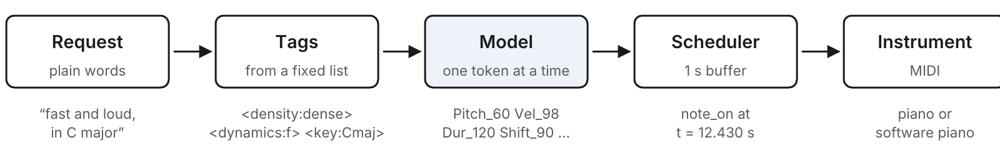

# 1. What we are building

The finished system is a chain of five small pieces. A request goes in at one end and key presses come out of the other.

1.  **The request.** Plain words from you: "fast and loud, in C major".
2.  **Tags.** A handful of labels from a fixed list, such as `<density:dense>`, `<dynamics:f>` and `<key:Cmaj>`. In Part I a small table of keywords turns the request into tags. The model itself only ever sees tags.
3.  **The model.** A transformer that reads the tags and then writes music one token at a time. A token is a single symbol from a vocabulary of 459: a pitch, a loudness, a duration or a wait. Four tokens or so make one note.
4.  **The scheduler.** A loop that keeps about one second of generated notes in a buffer and releases each one at exactly the right moment.
5.  **The instrument.** Anything that accepts MIDI: a digital piano over USB, or a software piano on the Mac.

The model is *autoregressive*. That word means it produces its output one piece at a time, and each new piece is chosen by looking at everything it has produced so far. This is the same mechanism a language model uses to write text; here the "words" are notes.

## 1.1 Why this is feasible on small hardware

Audio is heavy: one second of sound is 44,100 numbers per channel. A performance is light: a pianist playing at a brisk pace strikes about ten keys per second, and each key press can be described with four small numbers. The model has to produce roughly 40 tokens per second on average, and perhaps 100 in a dense passage. A model of this size generates far faster than that on a laptop, which leaves time to spare for buffering and scheduling.

Training is also light. The main dataset, MAESTRO, holds about 200 hours of piano playing, and its note data is a 56 MB download. Our model has about 19 million parameters, which is small enough to train on a MacBook Pro.

## 1.2 The plan

| Step | What you do | Chapter | Rough time |
|----|----|----|----|
| 1 | Set up the Mac and a MIDI instrument | 4 | 30 minutes |
| 2 | Download MAESTRO and convert it | 5 to 7 | 20 minutes |
| 3 | Run the whole pipeline on toy data | 10 | 15 minutes |
| 4 | Train the real model | 11 | Several hours to overnight (estimate) |
| 5 | Generate, listen, play in real time | 12 to 14 | 1 hour |
| 6 | Run the validation tests | 15 | 30 minutes |
| 7 | If it passes: fine-tune Qwen on the DGX Spark | 16 to 22 | A day or more (estimate) |

## 1.3 What to expect from the result

A model of this size, trained on this data, should produce playing that sounds like a pianist improvising in a classical style: correct-sounding harmony for a few bars at a time, natural touch and timing, and a clear response to the tags. It will not produce a piece with a beginning, a development and an ending. Over a minute or two it wanders. That is the known limit of small models with a short memory, and chapter 23 discusses how to push past it.

It also cannot play a named tune. "Happy Birthday" appears in this book as an example of how notes become tokens, but a model trained on classical performances has never heard it and has no way to look it up. The model plays in a requested *manner*; it does not play requested *pieces*.
