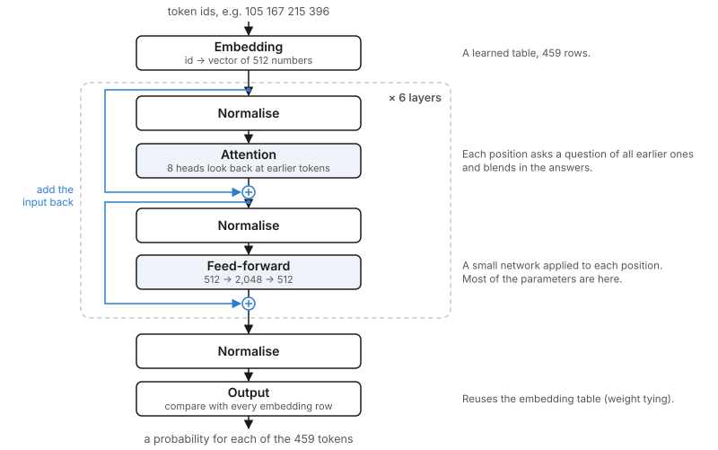

# 3. The theory you need

This chapter explains the model in plain terms. Nothing here is specific to music. If you already know how a GPT-style model works, skim it and go to chapter 4.

## 3.1 Predicting the next token

The model does one job: given a sequence of tokens, it outputs a probability for every token in the vocabulary being the next one.

Suppose the sequence so far is `Pitch_67 Vel_82 Dur_370 Shift_380`. A trained model might say the next token is `Pitch_67` with probability 0.21, `Pitch_69` with 0.14, `Pitch_64` with 0.09, and so on across all 465 tokens. To generate, we pick one token according to those probabilities, add it to the sequence, and ask again. Repeating this is all that "playing" means.

## 3.2 How the model is trained

Training uses recordings of real performances. Take a passage of 1,000 tokens. At every position, the model is shown the tokens before it and asked for the probabilities of the next one. We know the right answer, because it is in the recording.

The score for one position is the **cross-entropy loss**: minus the natural logarithm of the probability the model gave to the correct token.

- If the model gave the correct token probability 1.0, the loss is 0.
- If it gave 0.5, the loss is 0.69.
- If it gave 1/465, which is what blind guessing gives, the loss is 6.14.

The loss of a batch is the average over all positions. Training repeatedly nudges the model's parameters in the direction that lowers this average. The nudging is done by an optimiser; ours is AdamW, a standard choice.

One number is easier to picture than the loss: **perplexity**, which is e raised to the loss. A perplexity of 6 means the model is, on average, as uncertain as if it were choosing among 6 equally likely tokens. Blind guessing has a perplexity of 465.

One pass through the model scores all 1,000 positions at once. This is possible because of a rule called the *causal mask*: when computing the prediction at position 500, the model is prevented from looking at positions 501 and later. Every position therefore gets an honest "predict what comes next" exercise from a single pass.

## 3.3 Inside the transformer

The model is a stack of identical layers. Data flows through it like this.



**Embedding.** Each token id is replaced by a list of 512 numbers, called a vector. The table that holds one vector per token is learned. Tokens that behave similarly, such as neighbouring pitches, end up with similar vectors.

**Attention.** This is the part that lets each position look back at earlier ones. For every position, the layer computes a *query* ("what am I looking for?"), and for every earlier position a *key* ("what do I offer?") and a *value* ("what I pass on if chosen"). The query is compared with all the keys; positions whose keys match well contribute more of their values. In music, a position deciding the next pitch might attend strongly to the last few pitches and to the key tag at the very start.

The layer does this eight times in parallel with different learned queries, keys and values. Each of the eight is called a *head*. One head might track the harmony while another tracks the rhythm.

**Feed-forward.** After attention, each position's vector goes through a small two-layer network that widens it to 2,048 numbers and narrows it back to 512. This is where most of the parameters live, and where the model stores what it has learned about what tends to follow what.

**Residual connections and normalisation.** Each sub-layer adds its result to its input instead of replacing it, and the input is rescaled to a standard size first. These two details do nothing musical. They are what make a deep stack trainable.

**Output.** After six layers, the final vector at each position is compared with every row of the embedding table. The similarity scores are called *logits*; a function called softmax turns them into probabilities. Reusing the embedding table for the output is called *weight tying*. It saves parameters and usually helps small models.

## 3.4 How the model knows the order of tokens

Attention on its own treats its input as an unordered set. The model needs to know that one token came three places before another.

We use **rotary position embedding** (RoPE). Before queries and keys are compared, each is rotated by an angle that depends on its position. The comparison between two tokens then depends on how far apart they are, and not on where they sit in absolute terms. That property matters for us: the model is trained on passages cut from the middle of pieces, and at playing time its window slides forward for ever. A scheme based on relative distance does not care where the window starts.

## 3.5 Conditioning: how the tags steer the music

The tags are ordinary tokens placed at the start of the sequence:

``` text
<bos> <density:sparse> <dynamics:p> <key:Dmin> <sep> Pitch_62 Vel_46 Dur_800 ...
```

There is no special mechanism. During training, passages tagged `<dynamics:p>` are followed by low velocity tokens, and passages tagged `<key:Dmin>` are followed by the pitches of D minor. Attention lets every position look back at the tags, so the model learns to use them because doing so lowers its loss. At playing time we write the tags we want and let the model continue.

## 3.6 Choosing the next token: temperature and top-p

The model gives probabilities; we still have to pick. Two settings control how adventurous the pick is.

**Temperature** rescales the logits before the softmax. At 1.0 the probabilities are used as they are. Below 1.0 the likely tokens become more likely still, which gives safer, more repetitive playing. Above 1.0 the playing gets wilder and makes more mistakes.

**Top-p** (also called nucleus sampling) discards the unlikely tail. With top-p at 0.95, we keep the most probable tokens until their probabilities add up to 0.95, and choose only among those. This removes the rare, badly wrong choices that would otherwise slip in every few hundred tokens.

Sensible starting values are temperature 1.0 and top-p 0.95.

## 3.7 The key/value cache

Generating token by token would be wasteful if the model re-read the whole sequence each time. It does not need to. The keys and values of earlier positions never change, because of the causal mask, so they can be stored. To produce the next token the model then processes only the newest token and looks up the stored keys and values for the rest. This store is the *key/value cache*, and it is what makes real-time generation cheap.

## 3.8 Sizing the model

The size is set by three numbers: the width of the vectors (512), the number of layers (6) and the vocabulary (465). The parameter count follows directly.

| Part | Calculation | Parameters |
|----|----|----|
| Attention, per layer | 3 × 512 × 512 for queries, keys and values, plus 512 × 512 for the output | 1,048,576 |
| Feed-forward, per layer | 512 × 2,048, twice | 2,097,152 |
| Normalisation, per layer | 2 × 512 | 1,024 |
| **One layer** |  | **3,146,752** |
| Six layers | 6 × 3,146,752 | 18,880,512 |
| Embedding table (also the output layer) | 465 × 512 | 238,080 |
| Final normalisation | 512 | 512 |
| **Total** |  | **19,119,104** |

That is the "20M" model: 19.1 million parameters. Running `python model.py` prints the same figure.
