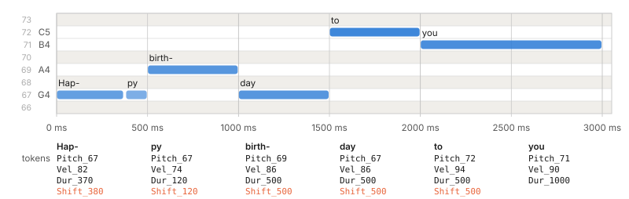

# 6. The tokeniser

The tokeniser decides what the model's "alphabet" is. It is the most consequential design decision in the project, because the model can only ever express what the tokens can say.

## 6.1 The design

Each note becomes three tokens, with waiting time written between notes:

``` text
Pitch  Vel  Dur   [Shift ...]   Pitch  Vel  Dur   [Shift ...]   ...
```

- **Pitch** says which key: one of 88.
- **Vel** says how hard, in 32 levels.
- **Dur** says how long the note sounds, from 10 ms to 8 s.
- **Shift** says how long to wait before the next note starts, from 10 ms to 1 s. Longer waits use several Shift tokens in a row. Notes that start together have no Shift between them, which is how a chord is written.

This family of encodings is known as TSD, for time-shift and duration. The MidiTok library implements a version of it that measures time in fractions of a beat. Ours measures time in milliseconds, because a recorded performance has no reliable beat grid to measure against.

There are two well-known alternatives, and it is worth knowing why we are not using them.

**Note-on / note-off events.** The original "performance" encoding has separate tokens for pressing and releasing each key. It needs more tokens per note, and if the model forgets to emit a release, the note is stuck on for ever. With an explicit duration, the player schedules the release itself and a stuck note is impossible.

**Bar and beat positions (REMI).** This encoding writes each note's position within a bar. It works well for scores. MAESTRO performances have no bar lines, and estimating them from rubato playing is unreliable.

## 6.2 Choosing the resolution

Each kind of token trades precision against vocabulary size.

**Time.** Onsets are rounded to a 10 ms grid. Ten milliseconds is at the edge of what a listener can detect in the timing of a single note, so the grid preserves expressive timing while keeping the number of Shift tokens to 100.

**Velocity.** The 127 MIDI levels are grouped into 32 bins of four. Adjacent levels are not distinguishable by ear.

**Duration.** Short durations need fine steps and long ones do not: the difference between 50 and 60 ms is audible, the difference between 5.0 and 5.1 s is not. The duration grid therefore has three zones.

| Range         | Step   | Tokens |
|---------------|--------|--------|
| 10 ms to 1 s  | 10 ms  | 100    |
| 1.05 s to 4 s | 50 ms  | 60     |
| 4.2 s to 8 s  | 200 ms | 20     |

## 6.3 The vocabulary

| Group | Count | Token ids | Examples |
|----|----|----|----|
| Special | 4 | 0 to 3 | `<pad>` `<bos>` `<eos>` `<sep>` |
| Tags | 61 | 4 to 64 | `<density:sparse>` `<key:Dmin>` `<composer:chopin>` `<genre:jazz>` |
| Pitch | 88 | 65 to 152 | `Pitch_21` ... `Pitch_108` |
| Velocity | 32 | 153 to 184 | `Vel_2` `Vel_6` ... `Vel_126` |
| Duration | 180 | 185 to 364 | `Dur_10` ... `Dur_8000` |
| Shift | 100 | 365 to 464 | `Shift_10` ... `Shift_1000` |
| **Total** | **465** |  |  |

The four special tokens have fixed jobs. `<pad>` fills the unused end of a short sequence. `<bos>` starts every sequence. `<sep>` marks the end of the tags and the start of the music. `<eos>` marks the true end of a piece.

## 6.4 The code

::: filename
tokenizer.py
:::

``` python
"""Performance tokeniser: notes <-> integer tokens.

A note is four numbers: onset time (ms), pitch (21-108), velocity (1-127)
and duration (ms). The token stream for a note is

    [Shift ...]  Pitch  Vel  Dur

where the optional Shift tokens say how long to wait since the previous
onset. Notes that start together (a chord) have no Shift between them.
"""
import numpy as np

# ---------------------------------------------------------------- vocabulary
SPECIALS = ["<pad>", "<bos>", "<eos>", "<sep>"]
PAD, BOS, EOS, SEP = 0, 1, 2, 3

KEYS = [f"{n}{m}" for m in ("maj", "min")
        for n in ("C", "Db", "D", "Eb", "E", "F", "Gb", "G", "Ab", "A", "Bb", "B")]
TAG_VALUES = {
    "density":  ["very_sparse", "sparse", "medium", "dense", "very_dense"],
    "dynamics": ["pp", "p", "mf", "f", "ff"],
    "register": ["low", "mid", "high"],
    "key":      KEYS,
    "era":      ["baroque", "classical", "romantic", "modern"],
    "composer": ["bach", "haydn", "mozart", "beethoven", "schubert", "chopin",
                 "schumann", "liszt", "mendelssohn", "brahms", "rachmaninoff",
                 "scriabin", "debussy", "ravel"],
    # MAESTRO is all classical; the rest come from Aria-MIDI's metadata (tags.aria_tags)
    "genre":    ["classical", "jazz", "pop", "film", "ragtime", "other"],
}
TAG_ORDER = list(TAG_VALUES)            # tags always appear in this order
TAGS = [f"<{k}:{v}>" for k in TAG_ORDER for v in TAG_VALUES[k]]

PITCH_MIN, PITCH_MAX = 21, 108          # the 88 keys of a piano
N_VEL = 32                              # velocity bins, 4 MIDI steps each
STEP_MS = 10                            # time resolution
SHIFT_GRID = np.arange(10, 1001, 10)    # 100 values: 10 ms ... 1 s
DUR_GRID = np.concatenate([
    np.arange(10, 1001, 10),            # 10 ms steps up to 1 s
    np.arange(1050, 4001, 50),          # 50 ms steps up to 4 s
    np.arange(4200, 8001, 200),         # 200 ms steps up to 8 s
])                                      # 180 values

VOCAB = (SPECIALS + TAGS
         + [f"Pitch_{p}" for p in range(PITCH_MIN, PITCH_MAX + 1)]
         + [f"Vel_{v * 4 + 2}" for v in range(N_VEL)]
         + [f"Dur_{d}" for d in DUR_GRID]
         + [f"Shift_{s}" for s in SHIFT_GRID])
TOKEN_ID = {name: i for i, name in enumerate(VOCAB)}
VOCAB_SIZE = len(VOCAB)

TAG0 = len(SPECIALS)
PITCH0 = TAG0 + len(TAGS)
VEL0 = PITCH0 + (PITCH_MAX - PITCH_MIN + 1)
DUR0 = VEL0 + N_VEL
SHIFT0 = DUR0 + len(DUR_GRID)
MUSIC0 = PITCH0                         # every id >= MUSIC0 is a music token

# midpoints between grid values: searchsorted on them rounds to the nearest duration
_DUR_EDGES = (DUR_GRID[:-1] + DUR_GRID[1:]) / 2


def kind(tok):
    """Which family a token id belongs to."""
    if tok >= SHIFT0: return "shift"
    if tok >= DUR0:   return "dur"
    if tok >= VEL0:   return "vel"
    if tok >= PITCH0: return "pitch"
    if tok >= TAG0:   return "tag"
    return "special"


# ------------------------------------------------------------------ encoding
def encode_tags(tags):
    """{'key': 'Cmaj', 'dynamics': 'p'} -> [BOS, tag ids..., SEP]."""
    ids = [TOKEN_ID[f"<{k}:{tags[k]}>"] for k in TAG_ORDER if tags.get(k)]
    return [BOS] + ids + [SEP]


def encode_notes(notes):
    """notes: array of rows (onset_ms, pitch, velocity, dur_ms) -> token ids."""
    notes = np.asarray(notes, dtype=np.float64).reshape(-1, 4)
    onset = np.round(notes[:, 0] / STEP_MS).astype(int)     # in 10 ms steps
    order = np.lexsort((notes[:, 1], onset))                # by onset, then pitch
    notes, onset = notes[order], onset[order]
    pitch = np.clip(notes[:, 1], PITCH_MIN, PITCH_MAX).astype(int) - PITCH_MIN
    vel = np.clip(notes[:, 2], 1, 127).astype(int) // 4   # 32 bins of 4
    dur = np.searchsorted(_DUR_EDGES, notes[:, 3])          # nearest DUR_GRID index

    # start the clock at the first onset, so the stream does not open with a wait
    out, now = [], onset[0] if len(onset) else 0
    for i in range(len(notes)):
        gap = int(onset[i] - now)
        while gap > 0:                                      # long waits chain
            s = min(gap, len(SHIFT_GRID))
            out.append(SHIFT0 + s - 1)                      # Shift of s * 10 ms
            gap -= s
        now = onset[i]
        out += [PITCH0 + int(pitch[i]), VEL0 + int(vel[i]), DUR0 + int(dur[i])]
    return out


# ------------------------------------------------------------------ decoding
def decode_notes(tokens):
    """Token ids -> array of rows (onset_ms, pitch, velocity, dur_ms).

    Ignores specials and tags, and drops a trailing incomplete note."""
    notes, now, cur = [], 0, []
    for t in tokens:
        k = kind(t)
        if k == "shift":
            now += int(SHIFT_GRID[t - SHIFT0]); cur = []    # drop a half-built note
        elif k == "pitch":
            cur = [t - PITCH0 + PITCH_MIN]
        elif k == "vel" and len(cur) == 1:
            cur.append((t - VEL0) * 4 + 2)                  # centre of the bin
        elif k == "dur" and len(cur) == 2:
            notes.append((now, cur[0], cur[1], int(DUR_GRID[t - DUR0]))); cur = []
    return np.array(notes, dtype=np.float64).reshape(-1, 4)


def describe(tokens):
    """Human-readable token names, for printing."""
    return " ".join(VOCAB[t] for t in tokens)


# ------------------------------------------------------------------- grammar
def allowed_next(prev):
    """Boolean mask over the vocabulary: which tokens may follow `prev`.

    Used at generation time so the model can never emit a malformed note."""
    m = np.zeros(VOCAB_SIZE, dtype=bool)
    k = kind(prev)
    if k == "pitch":   m[VEL0:DUR0] = True
    elif k == "vel":   m[DUR0:SHIFT0] = True
    elif k == "dur":   m[PITCH0:VEL0] = True; m[SHIFT0:] = True; m[EOS] = True
    elif k == "shift": m[PITCH0:VEL0] = True; m[SHIFT0:] = True
    else:              m[PITCH0:VEL0] = True      # right after <sep>
    return m


if __name__ == "__main__":
    # demo: encode a short tune, print the tokens, and decode it back
    print("vocabulary size:", VOCAB_SIZE)
    # the opening of "Happy Birthday": onset, pitch, velocity, duration
    hb = [(0, 67, 80, 375), (375, 67, 72, 125), (500, 69, 84, 500),
          (1000, 67, 84, 500), (1500, 72, 92, 500), (2000, 71, 88, 1000)]
    ids = encode_tags({"key": "Cmaj", "dynamics": "f"}) + encode_notes(hb)
    print(describe(ids))
    print(ids)
    print(decode_notes(ids))
```

The top of the file builds the vocabulary as a single list of names. A token's id is its position in that list. The constants `PITCH0`, `VEL0`, `DUR0` and `SHIFT0` record where each group starts, so converting between an id and its meaning is a subtraction.

`encode_notes` first sorts the notes by onset, and by pitch within a chord, so the same music always produces the same tokens. It rounds every onset to the 10 ms grid *before* taking differences. Rounding the differences instead would let small errors accumulate, and after a few minutes the music would drift away from the original timing.

`decode_notes` keeps a clock, advances it on each Shift, and emits a row when it has seen a Pitch, a Vel and a Dur in that order. Anything malformed is skipped.

## 6.5 The opening of Happy Birthday, as tokens

Run the file to see a concrete example:

``` bash
python tokenizer.py
```

``` text
vocabulary size: 465
<bos> <dynamics:f> <key:Cmaj> <sep> Pitch_67 Vel_82 Dur_370 Shift_380 Pitch_67 Vel_74
Dur_120 Shift_120 Pitch_69 Vel_86 Dur_500 Shift_500 Pitch_67 Vel_86 Dur_500 Shift_500
Pitch_72 Vel_94 Dur_500 Shift_500 Pitch_71 Vel_90 Dur_1000
[1, 12, 17, 3, 111, 173, 221, 402, 111, 171, 196, 376, 113, 174, 234, 414, 111, 174, 234,
 414, 116, 176, 234, 414, 115, 175, 284]
```



The six notes of "Hap-py birth-day to you" became 27 integers. The second line of output is what the model actually sees. Notice the small effects of the grid: the first note's 375 ms wait became `Shift_380`, and its velocity of 80 became `Vel_82`, the centre of its bin.

## 6.6 The grammar

A sequence of music tokens is only valid if the token kinds come in the right order. A Pitch must be followed by a Vel, a Vel by a Dur, and so on. The full rule is:

| After a ... | the next token may be ...                                   |
|-------------|-------------------------------------------------------------|
| `<sep>`     | Pitch                                                       |
| Pitch       | Vel                                                         |
| Vel         | Dur                                                         |
| Dur         | Pitch (another note at the same instant), Shift, or `<eos>` |
| Shift       | Shift or Pitch                                              |

A well-trained model follows this order almost always. "Almost" is not good enough for something that plays live, so `allowed_next` returns a mask of the legal tokens, and the generator in chapter 12 sets the probability of everything else to zero. The model can then never produce a malformed note, even early in training.

## 6.7 How many tokens is the dataset?

A note costs three tokens plus, usually, one Shift. Notes inside a chord need no Shift, and long silences need more than one. The average comes to a little under four tokens per note.

| Training split | Notes | Tokens (approx.) |
|----|---:|---:|
| MAESTRO | 5.66 million | 22 million |
| Aria-MIDI slice (chapter 7) | 53.6 million | 205 million |
| **Both** | **59.3 million** | **227 million** |

Keep that number in mind: about 227 million tokens of data for a model with 19 million parameters, or 12 tokens per parameter. On MAESTRO alone it would be about one token per parameter, enough for the model to memorise a good part of the training set. Augmentation (chapter 8) and watching the validation loss (chapter 11) still matter, but the second dataset is what moves the model out of that danger zone.
