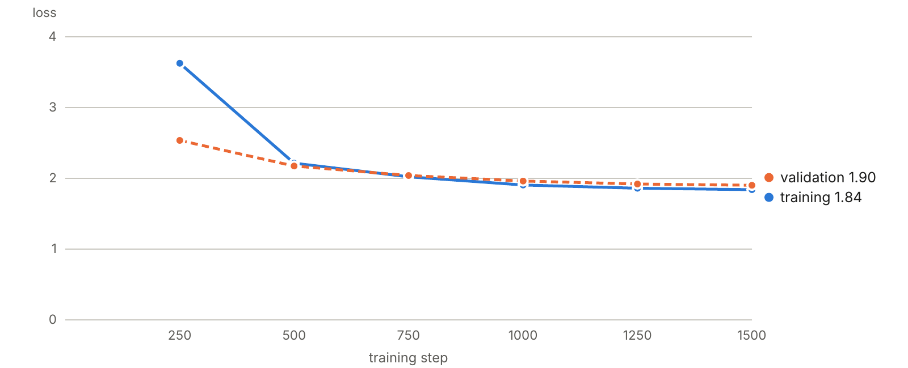

# 10. A smoke test on toy data

Before spending hours on real data, run the whole pipeline on something small. The goal is not good music. The goal is to find out in fifteen minutes whether every piece of code works together.

## 10.1 A fake dataset with obvious structure

`make_toy_data.py` writes 120 short MIDI files and a CSV file in exactly the layout MAESTRO uses. Each "piece" is a random walk up and down one scale, with an occasional chord, at one fixed speed, loudness and register.

::: filename
make_toy_data.py
:::

``` python
"""Write a tiny fake dataset laid out exactly like MAESTRO, for smoke tests.

    python make_toy_data.py --out data/toy

The "music" is a random walk on a scale over simple chords. It is not good
music; it has an obvious key, loudness, speed and register, so we can check
that every stage of the pipeline works before spending hours on real data.
"""
import argparse, csv, os
import numpy as np
from midi_io import save_notes

MAJ, MIN = [0, 2, 4, 5, 7, 9, 11], [0, 2, 3, 5, 7, 8, 10]
COMPOSERS = ["Johann Sebastian Bach", "Wolfgang Amadeus Mozart", "Frédéric Chopin",
             "Claude Debussy", "Franz Schubert / Franz Liszt"]


def toy_piece(rng, seconds=60):
    tonic, scale = rng.integers(0, 12), (MAJ, MIN)[rng.integers(0, 2)]
    step_ms = rng.choice([60, 90, 140, 220, 450])         # speed of the melody
    loud = rng.choice([35, 52, 64, 76, 95])               # overall loudness
    centre = rng.choice([50, 62, 76])                     # register
    notes, t, degree = [], 0.0, 0
    while t < seconds * 1000:
        degree = int(np.clip(degree + rng.integers(-2, 3), -7, 7))
        pitch = centre + tonic + 12 * (degree // 7) + scale[degree % 7]
        vel = int(np.clip(loud + rng.normal(0, 5), 1, 127))
        notes.append((t, pitch, vel, step_ms * rng.uniform(0.6, 1.1)))
        if rng.random() < 0.12:                           # a triad underneath
            for d in (0, 2, 4):
                low = centre - 12 + tonic + scale[d]
                if low != pitch:
                    notes.append((t, low, max(vel - 10, 1), step_ms * 3))
        t += step_ms * rng.choice([1, 1, 1, 2]) + rng.normal(0, 4)
    notes = np.array(notes)
    notes[:, 1] = np.clip(notes[:, 1], 21, 108)
    notes[:, 0] = np.maximum(notes[:, 0], 0)
    return notes


def main():
    ap = argparse.ArgumentParser()
    ap.add_argument("--out", default="data/toy")
    ap.add_argument("--pieces", type=int, default=120)
    args = ap.parse_args()
    rng = np.random.default_rng(0)
    os.makedirs(os.path.join(args.out, "2004"), exist_ok=True)
    rows = []
    for i in range(args.pieces):
        name = f"2004/toy_{i:04d}.midi"
        save_notes(toy_piece(rng), os.path.join(args.out, name))
        split = "train" if i % 10 < 8 else ("validation" if i % 10 == 8 else "test")
        rows.append({"canonical_composer": COMPOSERS[i % len(COMPOSERS)],
                     "canonical_title": f"Toy piece {i}", "split": split, "year": 2004,
                     "midi_filename": name, "audio_filename": "", "duration": 60})
    path = os.path.join(args.out, "maestro-v3.0.0.csv")
    with open(path, "w", newline="", encoding="utf-8") as f:
        w = csv.DictWriter(f, fieldnames=list(rows[0]))
        w.writeheader(); w.writerows(rows)
    print(f"wrote {args.pieces} toy pieces to {args.out}")


if __name__ == "__main__":
    main()
```

The music is trivial on purpose. Because every piece has one unmistakable key, speed, loudness and register, we can ask a precise question after training: when we request `<dynamics:pp>`, does the model play quietly? A model that passes this test has a working data pipeline, working conditioning and a working generator.

## 10.2 Run it

``` bash
python make_toy_data.py --out data/toy
python prepare.py --maestro data/toy --out data/toy_prepared
python train.py --data data/toy_prepared --out runs/toy \
    --steps 1500 --batch 8 --ctx 192 --dim 96 --layers 2 --heads 4 \
    --warmup 100 --eval-every 250 --eval-batches 4 --lr 1e-3
python evaluate.py --model runs/toy/best --data data/toy_prepared --batches 4 --batch 8
```

The training command builds a very small model (two layers, vectors of 96 numbers, about 0.3 million parameters) so that it finishes quickly. On a Mac this should take a few minutes.

## 10.3 What a successful run looks like

These are the results from the run made while writing this book, with the commands above.

Training printed these evaluation lines:

``` text
0.3 M parameters, 96 training pieces
== step 250: train 3.626  val 2.536  (best, saved)
== step 500: train 2.214  val 2.175  (best, saved)
== step 750: train 2.023  val 2.040  (best, saved)
== step 1000: train 1.906  val 1.961  (best, saved)
== step 1250: train 1.860  val 1.920  (best, saved)
== step 1500: train 1.839  val 1.903  (best, saved)
```



The loss began between 6 and 7 and was under 2 by the end, which shows that the model is learning. Your numbers will differ slightly in the last digits.

The evaluation printed:

``` text
validation loss per token (lower is better; perplexity = e^loss)
  pitch     2.040   perplexity    7.7
  velocity  1.693   perplexity    5.4
  duration  2.124   perplexity    8.4
  shift     1.696   perplexity    5.5
  all       1.901   perplexity    6.7

tag adherence (generate with one tag, measure the result)
  tag        exact  within 1  chance
  density      60%      100%     20%
  dynamics     65%      100%     20%
  register     67%      100%     33%
```

The second table is the one to look at. Chapter 15 explains it in full; in short, the script asks the model for each value of a tag in turn and measures what comes out. A model that ignored its tags would score near the "chance" column. This one, after a few minutes of training on trivial data and given a single tag each time, landed on the requested value or its immediate neighbour every time.

Two more checks from the same run. A request with four tags, `density=sparse,dynamics=pp,register=low,key=Amin`, produced 100 notes that measured as exactly those four values. And a 400-note sample, long enough to make the small context window slide several times, still measured as the requested C major over its whole length.

A pitch perplexity of 7.7 is also what the data predicts. Each toy melody moves at random among five neighbouring scale steps, with an occasional chord, so even a perfect model could not do much better than about 5.

**What counts as a pass for you:** the validation loss ends near 2, and "within 1" is at or close to 100% for all three tags. If so, every stage works on your machine.

## 10.4 What to do if it fails

| Symptom | Likely cause |
|----|----|
| The loss stays above 6 | The model is not learning at all. Check that `prepare.py` printed sensible note counts. |
| The loss falls but tag adherence is at chance | The tags are not reaching the model. Print one example with `tokenizer.describe` and check the tags are there. |
| `loss is not finite` | The learning rate is too high for this configuration. Halve `--lr`. |
| An error inside `mx.compile` | Add `--no-compile`. Training will be somewhat slower but otherwise the same. |

Once the toy run passes, the code is known to work and any problem on real data is about the data or the settings.
