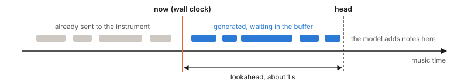

# 13. Playing in real time

Generating a file and playing live differ in one way: live, every note has a deadline.

## 13.1 The problem

The model produces tokens at an uneven rate. A chord of six notes needs about twenty tokens for a single instant of music, while a two-second held note needs four or five tokens for two seconds. If each note were sent the moment it was generated, chords would smear and the timing would follow the computer's workload instead of the music.

The solution is the one every media player uses: generate ahead into a buffer, and release from the buffer by the clock.



There are two clocks. **Music time** is the position in the piece: the sum of all the Shift tokens so far. **Wall-clock time** is the real time since playing started. The scheduler keeps the music-time position of the newest generated note (the *head*) about one second ahead of the wall clock, and sends each event when the wall clock reaches its music time.

For a performer that plays on its own, the size of that buffer costs nothing. Nobody is waiting for a response to a key press, so a one-second head start is inaudible. What matters is *throughput*: on average the model must generate tokens faster than the music uses them. The buffer absorbs the bursts.

## 13.2 The code

::: filename
play.py
:::

``` python
"""Play in real time on a MIDI instrument.

    python play.py --list
    python play.py --port "IAC Driver Bus 1" --request "calm, quiet, in F major"

While it plays, type a new request and press Enter to change the music.
Ctrl-C stops (and silences every key).
"""
import argparse, heapq, queue, sys, threading, time
from performer import Performer
from request import parse_request, parse_tags


class PrintPort:
    """Stands in for a MIDI port: prints what would be sent."""
    def send(self, kind, pitch, velocity):
        print(f"{time.monotonic() % 1000:8.3f}  {kind:<8} pitch {pitch:3d}  vel {velocity:3d}")
    def close(self):
        pass


class MidiPort:
    def __init__(self, name):
        import mido
        self.mido, self.port = mido, mido.open_output(name)
    def send(self, kind, pitch, velocity):
        self.port.send(self.mido.Message(kind, note=pitch, velocity=velocity))
    def close(self):
        self.port.reset()          # all notes off
        self.port.close()


class Scheduler(threading.Thread):
    """Holds generated notes and sends each event at its exact time.

    It runs on its own thread, so sending never waits for the model. Times
    are "music time": seconds since the start of the performance."""

    def __init__(self, port):
        super().__init__(daemon=True)
        self.port, self.lock = port, threading.Lock()
        self.events = []       # heap of (time, order, count, kind, pitch, vel, id)
        self.last = {}         # pitch -> (id, off time) of its most recent note
        self.cut = set()       # ids of notes that were cut short by a re-strike
        self.count = 0
        self.worst = 0.0       # largest lateness of any sent event, in seconds
        self.running = True
        self.t0 = time.monotonic() + 0.25          # small run-up before bar one

    def now(self):
        return time.monotonic() - self.t0

    def pause(self, seconds):
        """Move the whole timeline later (used when generation falls behind)."""
        with self.lock:
            self.t0 += seconds

    def add_note(self, on, pitch, vel, dur):
        with self.lock:
            self.count += 1
            nid = self.count
            old = self.last.get(pitch)
            if old and old[1] > on:                # key is still down: release it
                self.cut.add(old[0])               # first, and ignore the old note's
                self._push(on, 0, "note_off", pitch, 0, None)   # own note-off later
            self.last[pitch] = (nid, on + dur)
            self._push(on, 1, "note_on", pitch, vel, nid)
            self._push(on + dur, 0, "note_off", pitch, 0, nid)

    def _push(self, t, order, kind, pitch, vel, nid):
        self.count += 1
        heapq.heappush(self.events, (t, order, self.count, kind, pitch, vel, nid))

    def pending(self):
        return len(self.events)

    def run(self):
        while self.running:
            due = []
            with self.lock:
                now = self.now()
                while self.events and self.events[0][0] <= now:
                    t, _, _, kind, pitch, vel, nid = heapq.heappop(self.events)
                    if kind == "note_off" and nid in self.cut:
                        self.cut.discard(nid)      # already released early
                        continue
                    due.append((kind, pitch, vel))
                    self.worst = max(self.worst, now - t)
            for event in due:
                self.port.send(*event)
            time.sleep(0.001)


def play(performer, port, lookahead=1.0, seconds=None, commands=None, to_request=None):
    """Keep `lookahead` seconds of music generated ahead of the clock."""
    sched = Scheduler(port)
    sched.start()
    head = 0.0         # music time of the latest generated note onset
    notes = late = 0
    try:
        while seconds is None or head < seconds:
            if commands is not None and not commands.empty():
                performer.set_request(to_request(commands.get()))   # new request typed
            if head - sched.now() >= lookahead:
                time.sleep(0.002)                  # the buffer is full: rest
                continue
            r = performer.step()                   # generate one token
            if r == "end":
                break
            if r:
                wait_ms, pitch, vel, dur_ms = r
                head += wait_ms / 1000
                behind = sched.now() - head
                if behind > 0:                     # generation fell behind:
                    sched.pause(behind + 0.05)     # pause the music, don't rush it
                    late += 1
                sched.add_note(head, pitch, vel, dur_ms / 1000)
                notes += 1
        while sched.pending():                     # let the last notes finish
            time.sleep(0.01)
    except KeyboardInterrupt:
        pass
    finally:
        sched.running = False
        sched.join()
        port.close()
    return {"notes": notes, "underruns": late,
            "worst_lateness_ms": round(sched.worst * 1000, 1)}


def stdin_commands():
    """Lines typed on the keyboard arrive in a queue, without blocking."""
    q = queue.Queue()
    def reader():
        for line in sys.stdin:
            if line.strip():
                q.put(line.strip())
    threading.Thread(target=reader, daemon=True).start()
    return q


def main():
    ap = argparse.ArgumentParser()
    ap.add_argument("--list", action="store_true", help="list MIDI output ports")
    ap.add_argument("--model", default="runs/v1/best")
    ap.add_argument("--port", default=None, help="MIDI port; omit to print events")
    ap.add_argument("--request", default="")
    ap.add_argument("--tags", default="")
    ap.add_argument("--lookahead", type=float, default=1.0, help="seconds generated ahead")
    ap.add_argument("--seconds", type=float, default=None, help="stop after this much music")
    ap.add_argument("--temperature", type=float, default=1.0)
    ap.add_argument("--top-p", type=float, default=0.95)
    ap.add_argument("--seed", type=int, default=None)
    args = ap.parse_args()

    if args.list:
        import mido
        print("\n".join(mido.get_output_names()) or "no MIDI output ports found")
        return

    from model import Pianist
    from performer import MLXBackend
    tags = parse_tags(args.tags) if args.tags else parse_request(args.request)
    print("tags:", tags, file=sys.stderr)
    model, _ = Pianist.load(args.model)
    performer = Performer(MLXBackend(model), tags, args.temperature, args.top_p, seed=args.seed)
    port = MidiPort(args.port) if args.port else PrintPort()
    stats = play(performer, port, args.lookahead, args.seconds,
                 commands=stdin_commands(), to_request=parse_request)
    print(stats, file=sys.stderr)


if __name__ == "__main__":
    main()
```

The work is split between two threads, which are two lines of execution running side by side in the same program.

**The scheduler thread** does nothing but watch the clock. Events wait in a heap, a structure that always hands back the earliest one. A thousand times a second the thread checks whether the earliest event is due, and sends it if so. Because this thread never runs the model, a slow moment in generation cannot delay a note that is already in the buffer.

**The main thread** runs the model. Its loop in `play` checks whether you have typed a new request, then looks at how far the head is in front of the clock. If the gap is smaller than `lookahead`, it generates one more token; otherwise it rests for two milliseconds.

The two threads share the heap, so every access to it is wrapped in a lock, which lets only one of them touch it at a time.

Three details prevent the usual real-time bugs.

**Stuck and cut-off notes.** When the same key is struck again before the earlier note has ended, `add_note` schedules a `note_off` just before the new `note_on`, and records the earlier note's id in `cut`. When that earlier note's own `note_off` comes due, the scheduler sees its id in `cut` and drops it. Without this, the stale `note_off` would arrive in the middle of the new note and silence it.

**Falling behind.** If a note is finished after its own start time has already passed, the generator has failed to keep up. `play` then moves the whole timeline later by the shortfall, which the listener hears as a brief hesitation, and counts an *underrun*. The alternative, playing the late notes as fast as possible to catch up, sounds much worse.

**Stopping.** Whatever happens, including Ctrl-C, the `finally` block stops the scheduler and resets the port, which releases every key.

::: {.admonition .note}
Threads and the model

The model is only ever called from the main thread. That is deliberate: machine-learning frameworks, MLX included, are not reliably safe to call from several threads at once. The scheduler thread touches only the clock, the heap and the MIDI port.
:::

## 13.3 Play

``` bash
python play.py --model runs/v1/best --port "IAC Driver Bus 1" \
    --request "calm and quiet, in F major"
```

You should hear the piano begin within a second. While it plays, type a new request and press Enter:

``` text
fast and loud in C minor
```

The music moves to the new request over the next few seconds. Press Ctrl-C to stop. The script then prints a summary such as:

``` text
{'notes': 812, 'underruns': 0, 'worst_lateness_ms': 1.9}
```

`underruns` should be 0, or 1 if the very first note was slow while the model warmed up. `worst_lateness_ms` is the largest delay between when an event was due and when it was sent, and should be a few milliseconds.

To check the scheduler without any MIDI device, leave out `--port`. The script then prints each event with its time instead of sending it:

``` bash
python play.py --model runs/v1/best --tags density=sparse,dynamics=pp --seconds 5
```

## 13.4 If the playing stutters

| Symptom | Fix |
|----|----|
| Underruns in dense passages only | Raise `--lookahead` to 2 or 3. A deeper buffer rides out longer bursts. |
| Underruns throughout | Generation is slower than the music. Close other heavy applications, and check the two speeds `sample.py` prints. |
| Timing is uneven but there are no underruns | The instrument or the software piano is adding its own delay. Lower its audio buffer size. |
| A hesitation every 20 seconds or so, counted as an underrun | The context rebuild is taking longer than the buffer holds. Raise `--lookahead`. |
